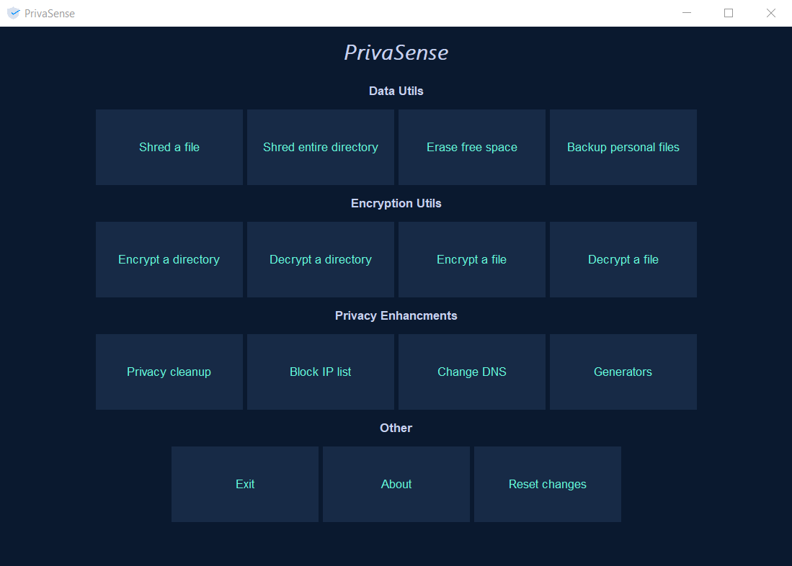

# PrivaSense
## Take back control over your privacy

## Features
- Encrypt and decrypt specific files or an entire directory using AES algorithm.
- Secure erase your files and folders with different algorithms.
- Erase the free space on your hard drive to prevent recovery.
- Backup your personal files to a chosen destination
- Privacy cleanup of your system.
- Block IP addresses

## Screenshot

